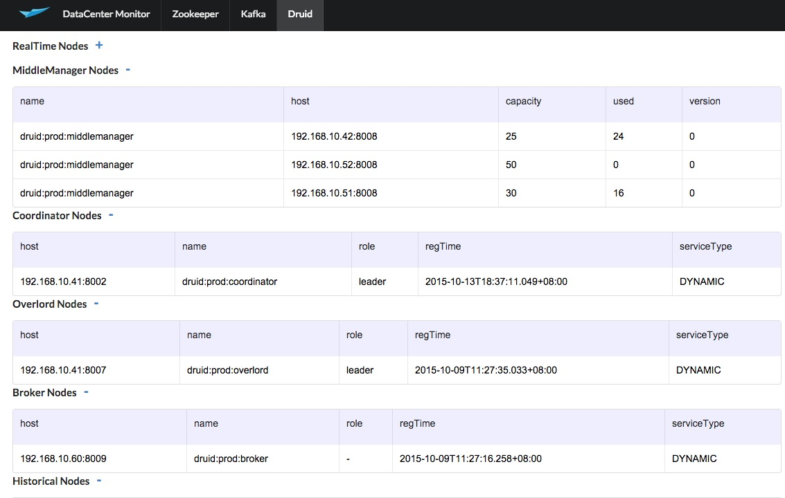

DCMonitor
=====

A simple, lightweight Data Center monitor, currently includes Zookeeper, Kafka, [Druid](http://druid.io/)(in progress). Motivated by [KafkaOffsetMonitor](https://github.com/quantifind/KafkaOffsetMonitor), but faster and more stable.

It is written in java, and use [InfluxDB v0.9](https://github.com/influxdb/influxdb) as historical metrics storage.

### NOTE

Everyone should check this [issue](https://github.com/shunfei/DCMonitor/issues/27) before deploying DCMonitor.

###Zookeeper monitor


###Kafka monitor


###Druid monitor



##Dependences

* Run
	* java(1.6 or later)
* Compile
	* java(1.7 or later)

##Installation

* Set up your Zookeeper, Kafka, Druid(If you have) for monitoring.
* Set up [InfluxDB 0.9 Stable](https://influxdb.com/docs/v0.9/introduction/installation.html).
	
	* Download and Install InfluxDB.
	
	* Configure InfluxDB
		
		Two ways to create a database for metrics storing.
		
		* You can choose to create a database for DCMonitor by youself, can be done by sending HTTP POST requests like this:
	
			```
			curl -G 'http://192.168.10.51:8086/query?u=root&p=root' --data-urlencode "q=CREATE database dcmonitor"
			
			curl -G 'http://192.168.10.51:8086/query?u=root&p=root&db=dcmonitor' --data-urlencode "q=CREATE RETENTION POLICY seven_days ON dcmonitor DURATION 168h REPLICATION 1 DEFAULT"
		
			```
	
		here `192.168.10.51:8086` is where InfluxDB installed, `dcmonitor` is the database you configured in config.json, and `168h` shows we only keep the last 7 days historical metrics. Check [here](https://influxdb.com/docs/v0.9/query_language/database_administration.html) for detail.
		
		* Or you don't have to do anyting, leave DCMonitor do this for you. DCMonitor will automatically create a database with seven days retention policy if it doesn't exits. Node that you still can change the retention policy later by
		
			```
			ALTER RETENTION POLICY seven_days ON dcmonitor DURATION 2d
			```
			
			or create another new default one to replace the old default:
			
			```
			CREATE RETENTION POLICY two_days ON dcmonitor DURATION 2d REPLICATION 1 DEFAULT
			```

			DCMonitor will choose the default policy to ingest metrics.
		
* Compile & deploy DCMonitor

	* Currently [influxdb-java](https://github.com/influxdb/influxdb-java) haven't been published to maven host yet, you have to compile & install it to your maven local repository. 
	
		If you are using java 1.7, you probably have to remove the test code, otherwise may cause [issue](https://github.com/influxdb/influxdb-java/issues/37)
			
		```
		git@github.com:influxdb/influxdb-java.git
		cd influxdb-java
		rm -rf src/test
		mvn clean install
		```
		
	* Compile DCMonitor
	
		```
		git clone git@github.com:shunfei/DCMonitor.git
		cd DCMonitor
		./build.sh
		```
		Then a `target` folder will be generated under root folder.
	
	* deploy
	
		You only need to deploy `target`, `run.sh`, `config` to target machine. 
		
		Modify configurations in `config/config.json`.
		
		Run `run.sh`, if every thing is fine, visit `http://hostname:8075` to enjoy!
	
	